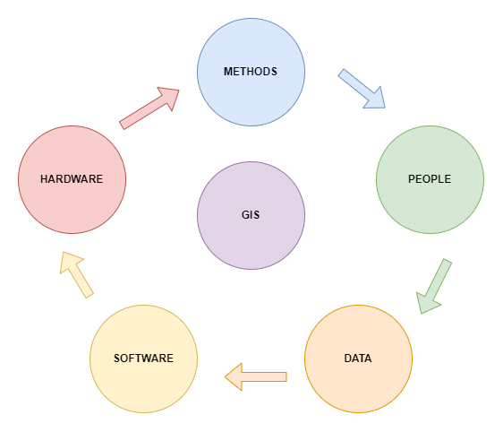

# Unit 01: Introduction to Geographic Information Systems

## Definition, Functions and Applications of GIS

**Geographic Information Technologies**

- **Global Positioning Systems (GPS)**: a system of earth-orbiting satellites which can provide precise (100 meter to sub-cm) location on the earth's surface.

- **Remote Sensing (RS)**:

  - Use of satellites or aircraft to capture information about the earth's surface.
  - Digital ortho images a key product (map accurate digital photos)

- **Geographic Information Systems (GIS):** Software systems with capability for input, storage, manipulation/analysis and output/display of geographic (spatial) information.

- **GPS** and **RS** are sources of input data for a GIS.

- **GI** Systems provide the means for storing, manipulating and making effective use of GPS and RS data.

**Definitions**

- "a system of hardware, software, and procedures designed to support the capture, management, manipulation, analysis, modeling, and display of spatially referenced data for solving complex planning and management problems." (Rhind, 1989)

- "a computer system capable of assembling, storing, manipulating, and displaying geographically referenced information." (USGS, 1997)

- "a computer system that allows the analysis and display of data with a spatial component." (Phillips, 2002).

- “a set of computer-based systems for managing geographic data and using those data to solve spatial problems” (Lo & Yeung, 2002).

- A geographic information system (GIS) is a computer system for capturing, storing, checking, and displaying data related to positions on Earth's surface. GIS can show many different kinds of data on one map, such as streets, buildings, and vegetation.

- A GIS is a computer-based system that provides the following four sets of capabilities to handle georeferenced data:

  1. Data Capture and Preparation

  2. Data Management, including Storage and Maintenance

  3. Data Manipulation and Analysis

  4. Data Presentation

- **Geographic Information Systems (GIS)** is a technological system that leverages locational and tabular data, computer hardware, and software to gather, map, and analyze geographically referenced data. GIS allows users to organize, visualize, and analyze different layers of data by creating maps and scenes.

- GIS gives you the power to:

  - create maps,
  - integrate information,
  - visualize scenarios,
  - present powerful ideas, and
  - develop effective solutions.

- **Geospatial data** describe both the locations and characteristics of spatial features. To describe a road, for example, we refer to its location (i.e., where it is) and its characteristics (e.g., length, name, speed limit, and direction).

**The major areas of GIS application**

- **Local Government**
  - Public Works/Infrastructure Management (Roads, Water, Sewer)
  - Planning and Environmental Management
  - Property Records and Appraisal
- **Real Estate and Marketing**
  - Retail Site Selection, Site Evaluation
- **Public Safety and Defense**
  - Crime Analysis, Fire Prevention, Emergency Management, Military/Defense
- **Natural Resource Exploration/Extraction**
  - Petroleum, Minerals, Quarrying
- **Transportation**
  - Airline Route Planning, Transportation Planning/ Modeling
- **Health Management**: (Health Systems, Health Centers, Management Beds)
- **Public health and epidemiology**
- **The Geospatial Industry**
  - Data Development, Application Development, Programming

Examples of Applied GIS

- **Urban Planning, Management & Policy**
  - Zoning, Subdivision Planning
  - Land Acquisition
  - Economic Development
  - Code Enforcement
  - Housing Renovation Programs
  - Emergency Response, Crime Analysis, Tax Assessment
- **Environmental Sciences**
  - Monitoring environmental risk
  - Modeling storm water runoff
  - Management of watersheds, floodplains, wetlands, forests, aquifers
  - Environmental Impact Analysis
  - Hazardous or toxic facility siting
  - Groundwater modeling and contamination tracking
- **Political Science**
  - Redistricting
  - Analysis of election results
  - Predictive modeling
- **Civil Engineering/Utility**
  - Locating underground facilities
  - Designing alignment for freeways, transit
  - Coordination of infrastructure maintenance
- **Business**
  - Demographic Analysis
  - Market Penetration/ Share Analysis
  - Site Selection
- **Education Administration**
  - Attendance Area Maintenance
  - Enrollment Projections
  - School Bus Routing
- **Real Estate**
  - Neighborhood land prices
  - Traffic Impact Analysis
  - Determination of Highest and Best Use
- **Health Care**
  - Epidemiology
  - Needs Analysis
  - Service Inventory

**Advantages of GIS**

- **Cost Saving from great efficiency**: The system is used to improve daily fleet activities and maintenance schedules. In implementing the system, it may cost great savings in operational expenses, staff time and have an efficient scheduling.
- **Improve communication**: Visualization and Geographical based maps assist in storytelling and understanding situations. This is used to improve communication between different departments, discipline, organization, professional fields, public and teams.
- **Managing Geographically**: The system is needed to understand what will happen and what is happening in geographic field.
- **Better Records Keeping**: Not just large entities or organizations needs to maintain valuable data. But each individual has important documents and data that need to be record and keep. GIS functions as maintenance and keeper of important records about the change and status of geography.
- **Decision making becomes better**: GIS is known for go to technology, for it makes better decision about area and location. Making right decision about certain location is hard and critical.

## Components of GIS

- **Hardware**: GIS hardware includes computers for data processing, data storage, and input/ output; printers and plotters for reports and hard-copy maps; digitizers and scanners for digitization of spatial data; and GPS and mobile devices for fieldwork.

- **Software** : GIS software, either commercial or open source, includes programs and applications to be executed by a computer for data management, data analysis, data display, and other tasks.

- Key software components are

  - Tools for the input and manipulation of geographic information.
  - A database management system (DBMS).
  - Tools that support geographic query, analysis, and visualization.
  - A graphical user interface (GUI) for easy access to tools.

- Additional applications, written in Python, JavaScript, VB.NET, or C++, may be used in GIS for specific data analyses.
- **Data**: The data is captured or collected from various sources (such as maps, field observations, photography, satellite imagery etc.) and is processed for analysis and presentation.
- **People**: The people who manage the system and develop plans for applying it to real-world problems.
- **Procedures**: These include the methods or ways by which data has to be input in the system, retrieved, processed, transformed and presented.

## GIS as Information System

## Nature and Sources of GIS Data

Spatial data formats

- Raster.
- Vector.

**Raster Data Format**

- Raster data represents a graphic object as a pattern of dots, whereas vector data represents the object as a set of lines drawn between specific points.

`Required figure for modelling the real world`

`Required figure for representation of geographic details, point, line and area feature`

`Required figure for storing of spatial data, vector and raster data formats.`

- Raster files are most often used:
  - For digital representations of aerial photographs, satellite images, scanned paper maps, and other applications with very detailed images.
  - When costs need to be kept down.
  - When the map does not require analysis of individual map features.
  - When ‘backdrop’ maps are required.
- The relationship between cell size and the number of cells is expressed as the resolution of the raster.
  - A finer resolution gives a more accurate and better quality image.

`Required figure for effect of grid size on data in raster format.`

**Vector Data Format**

- A vector data model uses points stored by their real (earth) coordinates.
  - Lines and areas are built from sequences of points in order.
  - Lines have a direction to the ordering of the points.
  - Polygons can be built from points or lines.
  - Vectors can store information about topology.

`Required figure for vector data model is based around the storage of coordinate pairs.`

Vector files are most often used:

- Highly precise applications.
- When file sizes are important.
- When individual map features require analysis.
- When descriptive information must be stored.

Comparison of Raster and Vector Data Formats.

| Raster Model                                                                         | Vector Model                                          |
| :----------------------------------------------------------------------------------- | :---------------------------------------------------- |
| **Advantages**                                                                       | **Advantages**                                        |
| Simple Data Stucture                                                                 | Compact data structure                                |
| Easy and efficient overlaying                                                        | Efficient for network analysis                        |
| Compatible with RS imagery                                                           | Efficient projection transformation                   |
| High spatial variability is efficiently represented                                  | Accurate map output                                   |
| Simple for own programming                                                           |                                                       |
| Same grid cells for several attributes                                               |                                                       |
| **Disadvantages**                                                                    | **Disadvantages**                                     |
| Inefficient useof computer storage                                                   | Complex data structure                                |
| Errors in perimeter and shape                                                        | Difficult overlay operations                          |
| Difficult network analysis                                                           | High spatial variability is inefficiently represented |
| Inefficient projection transformations                                               | Not compatible with RS imagery                        |
| Loss of information when using large cells less accurate (although interactive) maps |                                                       |

## Recent trends and future of GIS
